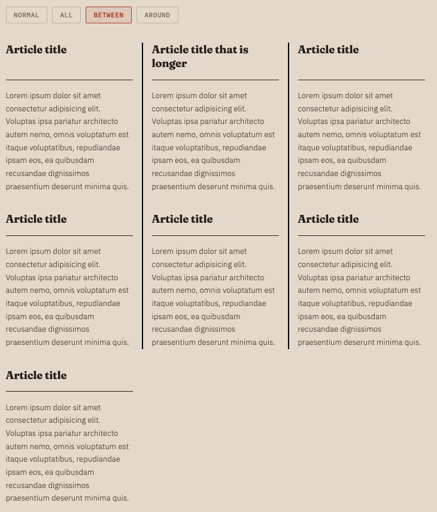

# Mind the Gap! CSS gap decorations available in Chrome 149

**Authors:** Javier Contreras, Sam Davis Omekara Jr
**Published:** 2026-05-06

If you've used borders or pseudo-elements to draw lines between grid or flex items, there's a native alternative now. CSS gap decorations shipped in Chrome and Edge 149. You can now  style the gaps in grid, flexbox, and multi-column layouts without any extra markup.

This feature was built in collaboration between the Microsoft Edge and Google Chrome teams, based on the [CSS Gap Decorations specification](https://www.w3.org/TR/css-gaps-1/).

## Useful links

- [CSS Gap Decorations specification](https://www.w3.org/TR/css-gaps-1/)
- [Developer trial blog post](https://developer.chrome.com/blog/gap-decorations) (Chrome 139)
- [Edge announcement](https://blogs.windows.com/msedgedev/2025/03/19/minding-the-gaps-a-new-way-to-draw-separators-in-css/)
- [Explainer on GitHub](https://github.com/MicrosoftEdge/MSEdgeExplainers/blob/main/CSSGapDecorations/explainer.md)

## The problem

Styling gaps between layout items has always required workarounds. Borders on individual items, pseudo-elements, background hacks. These approaches have costs:

- **They depend on structure.** Adding a visual separator means changing your markup or writing selectors for specific items.
- **They interfere with accessibility.** Extra DOM elements show up in the accessibility tree when they shouldn't.
- **They're hard to maintain.** Responsive layouts break the assumptions your gap styling was built on.
- **They hurt performance.** More DOM nodes, more layout work.
- **They have poor authoring ergonomics.** Complex geometric calculations were often needed to get things working correctly.

The column-rule property already handles this for multi-column layouts. But grid and flexbox had no equivalent functionality.

## The solution

Grid and flexbox containers now accept `column-rule`, which previously only worked in multi-column layouts. A new `row-rule` property handles horizontal gaps. The resulting decorations are purely visual and won't affect your existing layouts. If you already use `column-rule` in multi-column, nothing changes for you.

For example, here’s a flex container with three panels using a list of styles for its column and row rules:

```css
.flex-split {
  column-rule-width: 2px;
  column-rule-style: dashed, solid;
  column-rule-color: #d4d0c8;
}
```


[Try it](https://jav099.github.io/gap-decorations-blog-demos/demos/split-screen.html)

As illustrated in this example, both row-rule and column-rule accept the same shorthand for width, style, and color. And you can use the rule shorthand to set both at once.

### New properties

However, we didn't just bring `column-rule` to other layout modes and add the `row` counterpart. We also introduced controls for fine-tuning your decorations: how they break at intersections, how far they inset from gap edges, when they appear relative to items, and how to vary styles across gaps. Rule width, color, and insets are all animatable too.

### The repeat() syntax

Gap decorations support `repeat()` for their width, style, and color values. This lets you vary decorations across gaps in short form, similar to the `repeat()` syntax available when setting up your track definitions in grid:

```css
.settings-panel {
  row-rule: 1px solid #243352;
  row-rule-width: repeat(2, 1px), 4px;
}
```


[Try it](https://jav099.github.io/gap-decorations-blog-demos/demos/settings-list.html)

This gives the first two row gaps a 1px rule and the third a 4px rule, cycling if there are more gaps than values.

You can also pass multiple values directly without `repeat()`. For example, alternating row rule styles for hour and half-hour boundaries in a calendar:

```css
.calendar {
  row-rule-width: 2px, 1px;
  row-rule-style: solid, dashed;
  row-rule-color: #e8e4df, #f0ece7;
}
```


[Try it](https://jav099.github.io/gap-decorations-blog-demos/demos/calendar-week.html)

This alternates between a solid rule for hour boundaries and a dashed rule for half-hours.

### Controlling decoration breaks

The `column-rule-break` and `row-rule-break` properties control how decorations behave at gap intersections:

- `normal` (default) Behavior depends on the type of container. More information in the [spec](https://www.w3.org/TR/css-gaps-1/#breaks).
- `none`: decorations run continuously through intersections
- `intersection`: decorations break where row and column gaps cross

For example, if you set rule-break to intersection in a grid container, you will observe that rules break at gap intersections rather than continuing through:

```css
.dashboard {
  column-rule-style: solid;
  column-rule-color: #fbbf24, #34d399;
  column-rule-width: 1px, 3px;
  column-rule-break: intersection;
  row-rule: 1px solid #1e1e36;
}
```


[Try it](https://jav099.github.io/gap-decorations-blog-demos/demos/dashboard-grid.html)

If you set rule-break to none, the rules will run continuously through intersections without breaking:

```css
.grid {
  column-rule: 1px solid #5a9e9e;
  row-rule: 1px solid #c27a6b;
  rule-break: none;
}
```

You can try this value in the [interactive playground](https://microsoftedge.github.io/Demos/css-gap-decorations/playground.html).

### Extending or shrinking decorations

The `column-rule-inset` and `row-rule-inset` properties control how far decorations extend within a gap. You can set insets on all sides at once with the shorthand, or target insets asymmetrically with `column-rule-inset-cap` (for endpoints that have no crossing gaps, like edges of container) and `column-rule-inset-junction` (for endpoints that intersect with other gaps). 

Values can be lengths, percentages, or the `overlap-join` keyword.

For example, setting `rule-inset` to 5px will make all decorations "shrink" inwards 5px:

```css
.container {
  display: flex;
  flex-wrap: wrap;
  column-rule: 1px solid #2a2a45;
  column-rule-color: #60a5fa, #34d399, #a78bfa;
  rule-inset: 5px;
  row-rule: 1px solid #2a2a45;
}
```


[Try it](https://jav099.github.io/gap-decorations-blog-demos/demos/dynamic-items.html)

Setting `rule-inset-cap` to 0px and `rule-inset-junction` to 10px gives decorations that are flush at container edges but inset at intersections. The dashboard demo shown earlier uses this approach, and the insets animate on hover:


```css
.dashboard {
  rule-inset-cap: 0px;
  rule-inset-junction: 10px;
  transition: rule-inset-junction 0.4s;
}
.dashboard:hover {
  rule-inset-junction: 0px;
}
```


[Try it](https://jav099.github.io/gap-decorations-blog-demos/demos/dashboard-grid.html)

### Visibility

`column-rule-visibility-items` and `row-rule-visibility-items` control when rules appear based on item adjacency:

- `normal` (default) depends on container type.
- `all`: rules appear in every gap, even empty ones
- `around`: rules appear wherever there are one or more adjacent items.
- `between`: rules appear only between two adjacent items

The `rule-visibility-items` shorthand sets both at once.

Setting `rule-visibility-items` to `between` will show rules only between adjacent items, hiding them in gaps adjacent to empty cells:

```css
section {
  rule: 2px solid black;
  rule-visibility-items: between;
}
```



[Try it](https://jav099.github.io/gap-decorations-blog-demos/demos/article-grid.html)

On the other hand, setting `rule-visibility-items` to `all` will show rules in every gap, even those without adjacent items

### Animating decorations

Rule width, color, and insets are animatable. You can transition them on hover or any other state change. The dashboard demo shown earlier transitions rule colors and insets on hover:

```css
.dashboard {
  column-rule-color: #fbbf24, #34d399;
  rule-inset-junction: 10px;
  transition: column-rule-color 0.4s, rule-inset-junction 0.4s;
}
.dashboard:hover {
  column-rule-color: #3b82f6, #3b82f6;
  rule-inset-junction: 0px;
}
```

## Demos

All demos shown in this post are available at [jav099.github.io/gap-decorations-blog-demos](https://jav099.github.io/gap-decorations-blog-demos/).

The [developer trial blog post](https://developer.chrome.com/blog/gap-decorations) includes several more demos, including an [interactive playground](https://microsoftedge.github.io/Demos/css-gap-decorations/playground.html), a [burger menu](https://microsoftedge.github.io/Demos/css-gap-decorations/burger-menu.html), a [notebook layout](https://microsoftedge.github.io/Demos/css-gap-decorations/notebook.html), and a [magazine-style layout](https://microsoftedge.github.io/Demos/css-gap-decorations/daily-css-news.html) with a sudoku grid.

## What changed since the developer trial

If you tried gap decorations during the developer trial (Chrome 139), here's what changed:

- The feature ships by default, no flags needed
- Property names were updated to align with the spec (e.g., `column-rule-outset` and `row-rule-outset` became `column-rule-inset` and `row-rule-inset` sub-properties)
- The `column-rule-visibility-items` and `row-rule-visibility-items` properties were added
- Animation support was added.

## Use Gap Decorations today!

The CSS Gap decorations feature works today in Chrome and Edge 149. In browsers without support, gaps render normally with no decorations visible (outside of multicolumn layouts, which already supported a subset of the functionality).

File bugs at the [Chromium issue tracker](https://issues.chromium.org/issues/wizard). For more background, see the [CSS Gap Decorations specification](https://www.w3.org/TR/css-gaps-1/).
