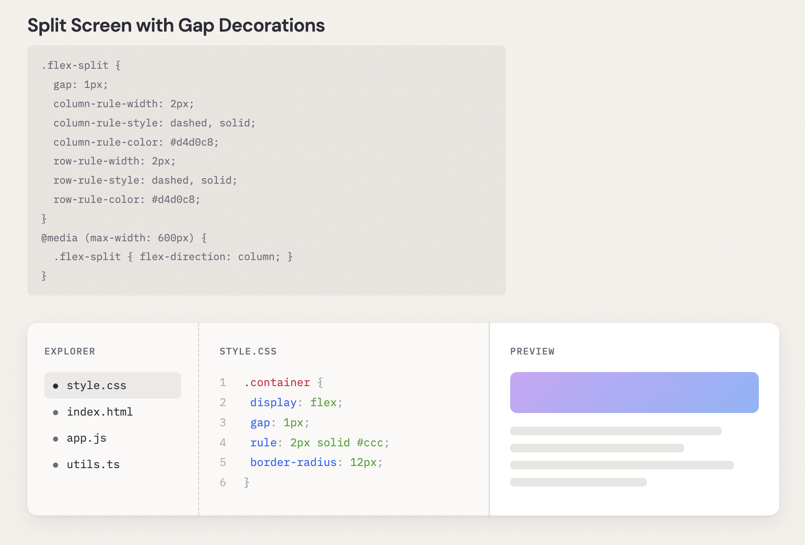
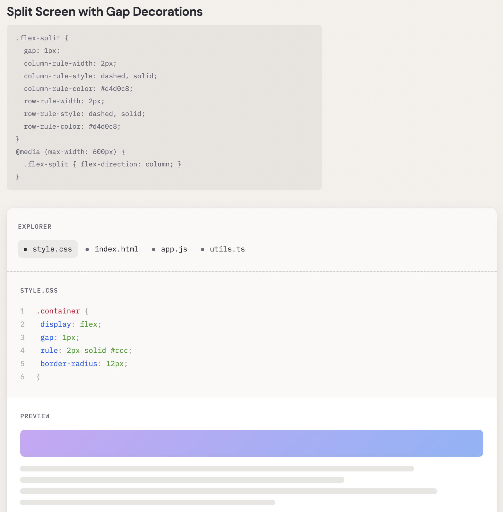
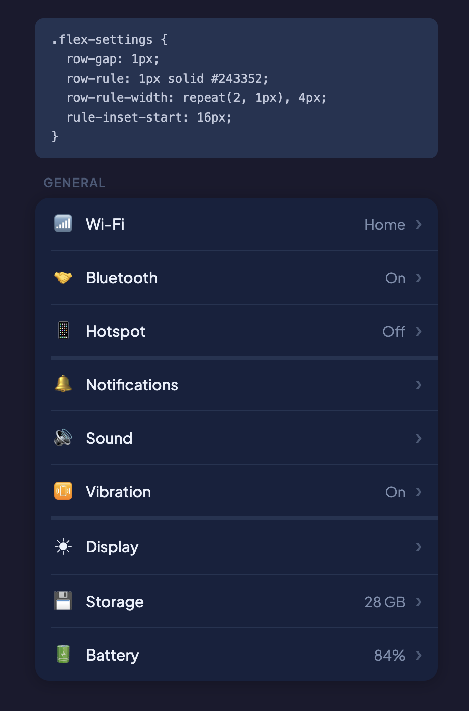
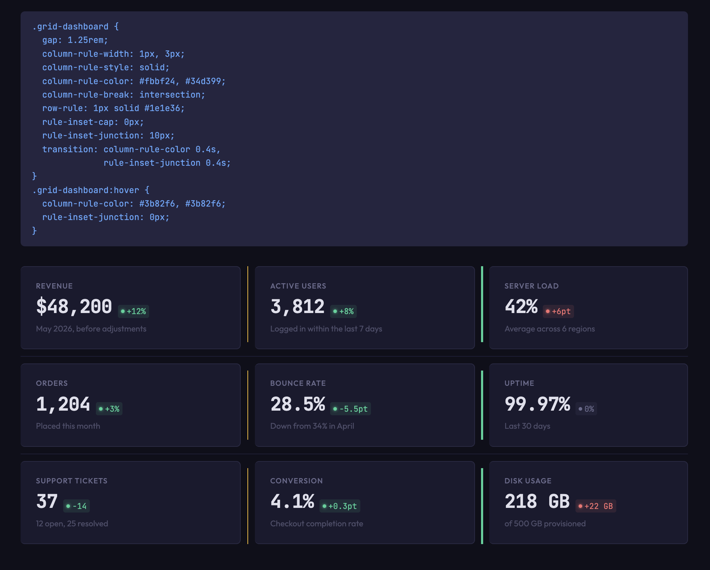
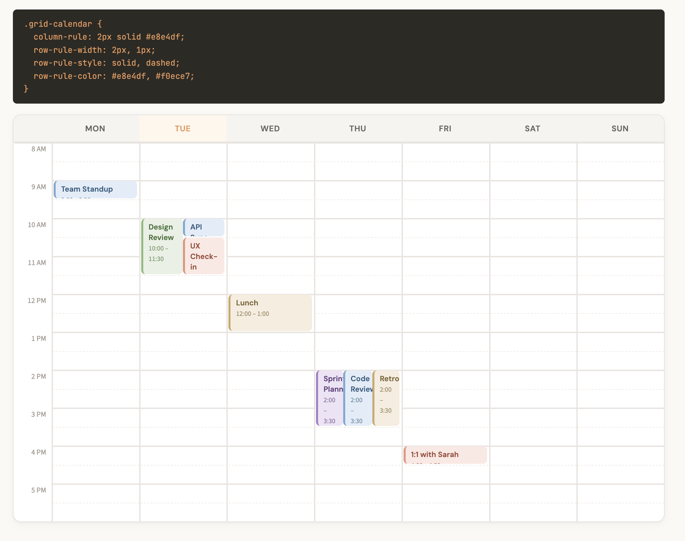
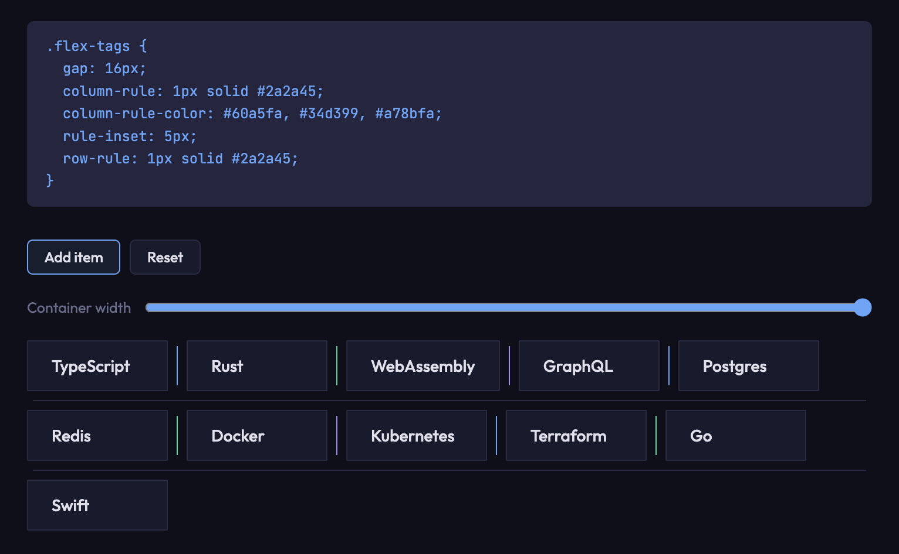
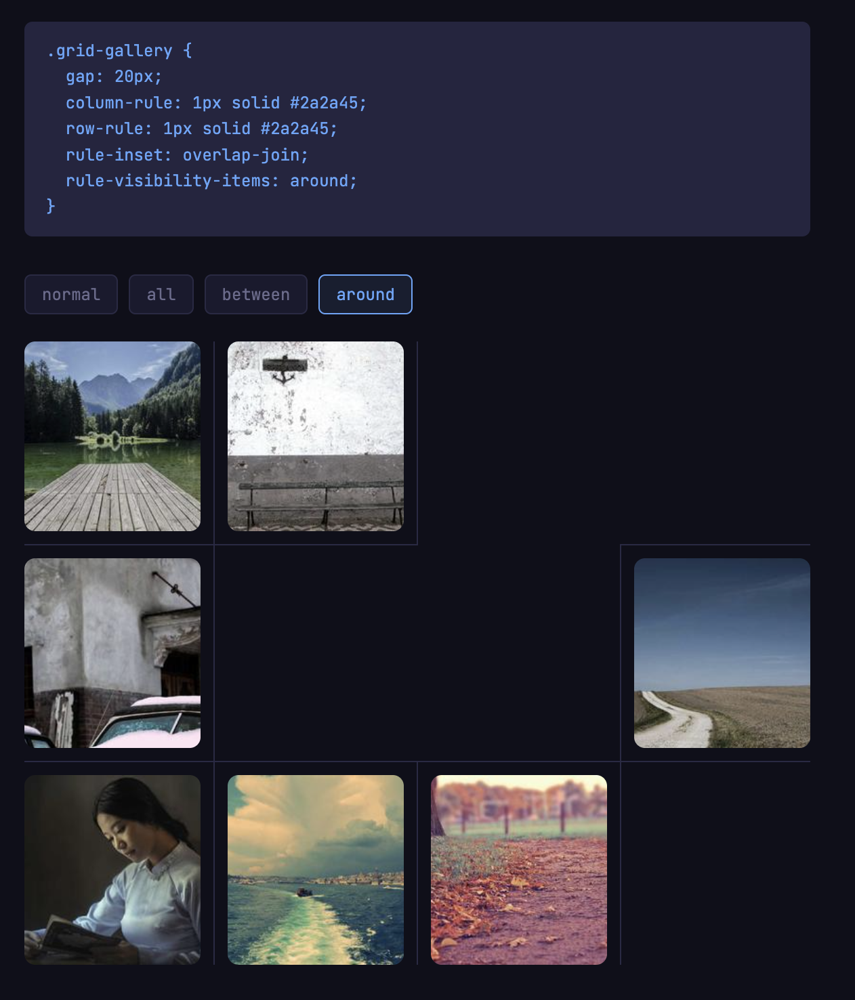

# Mind the Gap! CSS gap decorations available in Chrome 149

**Authors:** Javier Contreras, Sam Davis Omekara Jr
**Published:** 2026-05-06

If you've used borders or pseudo-elements to draw lines between grid or flex items, there's a native alternative now. CSS gap decorations ship in Chrome 149. They let you style the gaps in grid, flexbox, and multi-column layouts without extra markup.

This was built in collaboration with Microsoft's Edge team, based on the existing `column-rule` property and the [CSS Gap Decorations specification](https://www.w3.org/TR/css-gaps-1/).

## Useful links

- [CSS Gap Decorations specification](https://www.w3.org/TR/css-gaps-1/)
- [Developer trial blog post](https://developer.chrome.com/blog/gap-decorations) (Chrome 139)
- [Edge announcement](https://blogs.windows.com/msedgedev/2025/03/19/minding-the-gaps-a-new-way-to-draw-separators-in-css/)
- [Explainer on GitHub](https://github.com/MicrosoftEdge/MSEdgeExplainers/blob/main/CSSGapDecorations/explainer.md)

## The problem

Styling gaps between layout items has always required workarounds. Borders on individual items, pseudo-elements, background hacks. These approaches have costs:

- **They depend on structure.** Adding a visual separator means changing your markup or writing selectors for specific items.
- **They interfere with accessibility.** Extra DOM elements show up in the accessibility tree when they shouldn't.
- **They're hard to maintain.** Responsive layouts break the assumptions your gap styling was built on.
- **They hurt performance.** More DOM nodes, more layout work.

The `column-rule` property already handles this for multi-column layouts. But grid and flexbox had nothing equivalent.

## The solution

Grid and flexbox containers now accept `column-rule`, which previously only worked in multi-column layouts. A new `row-rule` property handles horizontal gaps. The decorations are purely visual and won't affect your existing layouts. If you already use `column-rule` in multi-column, nothing changes for you.

### New properties

Gap decorations add `row-rule` alongside `column-rule`. Both accept the same shorthand for width, style, and color. The `rule` shorthand sets both at once.

Here's what you can control for the decorations:

- **Break behavior** (`*-rule-break`, `rule-break`): whether decorations break at gap intersections or run continuously.
- **Insets** (`*-rule-inset-*`): how far decorations extend within a gap, with symmetric and asymmetric options.
- **Visibility** (`*-rule-visibility-items`): when rules appear based on item adjacency.
- **Varying styles** (`repeat()`): different decoration widths, styles, or colors across gaps in a container.
- **Animations**: rule width, color, and insets are animatable, so you can transition them smoothly.

`row-rule` and `column-rule` use the same shorthand syntax across grid, flexbox, and multi-column:

```css
.grid {
  display: grid;
  gap: 1rem;
  column-rule: 1px solid #ccc;
  row-rule: 1px solid #ccc;
}
```

### The repeat() syntax

Gap decorations support `repeat()` for their width, style, and color values. This lets you vary decorations across gaps:

```css
.grid {
  column-rule-width: repeat(2, 1px), 4px;
  column-rule-style: solid;
}
```

This gives the first two column gaps a 1px rule and the third a 4px rule, cycling if there are more gaps than values.

You can also pass multiple values directly without `repeat()`. For example, alternating row rule colors:

```css
.grid {
  row-rule: 1px solid;
  row-rule-color: red, blue;
}
```

This alternates between red and blue for each row gap.

### Controlling breaks

The `column-rule-break` and `row-rule-break` properties control how decorations behave at gap intersections:

- `normal` (default)
- `none`: decorations run continuously through intersections
- `intersection`: decorations break where row and column gaps cross

```css
.grid {
  column-rule: 1px solid #ccc;
  column-rule-break: intersection;
}
```

### Insets

The `*-rule-inset-*` properties control how far decorations extend within a gap. You can set insets on all sides at once with shorthands like `column-rule-inset`, or target assymetrically with longhands like `*-inset-cap-start` and `*-inset-junction-end`. Values can be lengths, percentages, or the `overlap-join` keyword.

```css
.grid {
  column-rule: 1px solid #ccc;
  column-rule-break: intersection;
  column-rule-inset: 5px; /* 5px inset on all segment endpoints */
}
```


### Visibility

`column-rule-visibility-items` and `row-rule-visibility-items` control when rules appear based on item adjacency:

- `normal` (default) depends on container type.
- `all`: rules appear in every gap, even empty ones
- `around`: rules appear wherever there are one or more adjacent items.
- `between`: rules appear only between two adjacent items

The `rule-visibility-items` shorthand sets both at once.

## Demos

The [developer trial blog post](https://developer.chrome.com/blog/gap-decorations) includes several more demos, including an [interactive playground](https://microsoftedge.github.io/Demos/css-gap-decorations/playground.html), a [burger menu](https://microsoftedge.github.io/Demos/css-gap-decorations/burger-menu.html), a [notebook layout](https://microsoftedge.github.io/Demos/css-gap-decorations/notebook.html), and a [magazine-style layout](https://microsoftedge.github.io/Demos/css-gap-decorations/daily-css-news.html) with a sudoku grid.

### Split screen

A flex container with three panels using a list of styles: `dashed, solid` for the column rules. On narrow viewports, the layout switches to `flex-direction: column` and the same pattern applies to the row rules.





[Try it](TODO)

### Settings list

A flex column where `repeat()` creates grouped separators. The pattern `repeat(2, 1px), 4px` cycles across all gaps, giving a thicker rule every third gap to visually separate groups without extra markup.



[Try it](TODO)

### Dashboard grid

A grid dashboard with alternating column rule colors and widths. On hover, the rules transition to a uniform color and the junction insets animate.



[Try it](TODO)

### Calendar week view

A weekly calendar grid with alternating row rules: solid for hour boundaries, dashed for half-hours.



[Try it](TODO)

### Dynamic flex items

A wrapping flex container where items can be added or removed. The decorations adapt automatically as items reflow. A width slider shows how the rules update as the container resizes.



[Try it](TODO)

### Photo gallery

A grid with intentional empty cells, demonstrating `rule-visibility-items`. Toggle between `normal`, `all`, `between`, and `around` to see how rules appear or disappear around empty slots.



[Try it](TODO)

## What changed since the developer trial

If you tried gap decorations during the developer trial (Chrome 139), here's what changed:

- The feature ships by default, no flags needed
- Property names were updated to align with the spec (e.g., `*-rule-offset` became `*-rule-inset-*` sub-properties)
- The `*-rule-visibility-items` properties were added
- Animation support was added.

## Browser support

| Browser | Support |
|---------|---------|
| Chrome  | 149+    |
| Edge    | 149+    |


## Try it

Gap decorations work today in Chrome 149. In browsers without support, gaps render normally with no decorations visible.

File bugs at the [Chromium issue tracker](https://issues.chromium.org/issues/wizard). For more background, see the [CSS Gap Decorations specification](https://www.w3.org/TR/css-gaps-1/).
